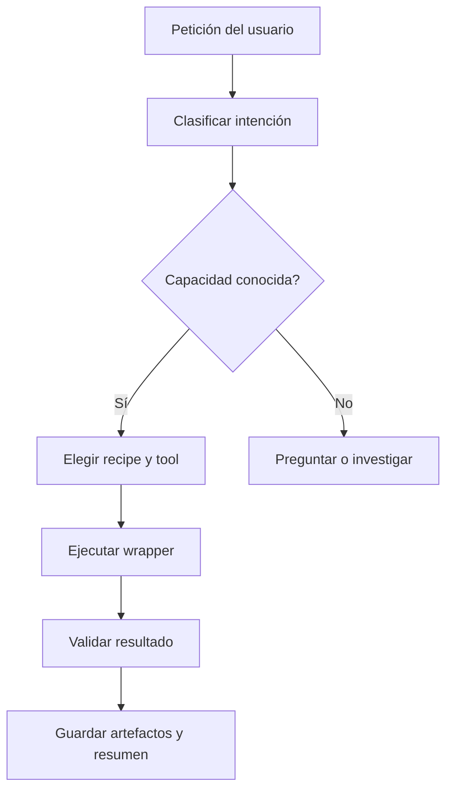

# Agent Toolkit — mapa de capacidades

## Propósito

Este documento es el índice operativo del agente. Describe qué puede hacer el
entorno, qué herramienta debe elegir y qué resultado debe producir.

El agente debe consultar este mapa antes de buscar en Internet o explorar toda
la documentación de una librería. No debe cargar repositorios completos en el
contexto: debe usar la capacidad más específica y leer solo sus archivos de
implementación, ejemplos o templates.

## Estado de las capacidades

| Estado | Significado |
|---|---|
| `implemented` | Existe un wrapper ejecutable y está verificado. |
| `implemented-unverified` | Existe el adaptador y su contrato/sintaxis está verificado, pero falta una prueba en el host real. |
| `available-source` | La librería está instalada, pero falta crear el wrapper. |
| `planned` | Capacidad definida para una fase posterior. |
| `blocked` | Existe un impedimento conocido. |

Actualmente las seis fuentes principales están instaladas en `C:\IA\svg`, y el
inventario también registra GDKB y los adaptadores de Blender y Adobe dentro de
`agent-toolkit`. `integration.sources` muestra su presencia y metadatos directos;
`integration.validate` comprueba entrypoints sin recorrer árboles completos.
El MVP local ya implementa jobs, generación/animación/validación/preview SVG,
un servidor HTTP local y un adaptador verificado para Blender 4.5.4 LTS con
Cycles.

El toolkit también implementa búsqueda de assets semánticos y visuales:
`asset.search` consulta PubChem, ChEBI y OLS para resolver conceptos y luego
Iconify y Bioicons para proponer SVG editables; `asset.fetch` descarga un asset;
`asset.select` crea un manifiesto con fuente, licencia, ancla y texto exacto.

GDKB 0.6.1 está integrado como capa de conocimiento local bajo
`integrations/gdkb/v0.6.1/` y se ejecuta mediante `adapters/gdkb/bridge.py`.
Conserva identidad, observaciones, evidencia, assertions, lifecycle, imports,
eventos, snapshots y decisiones de resolución auditables.

Las fuentes descargadas funcionan como biblioteca de referencia local; cada
capacidad marcada `implemented` apunta a un wrapper del toolkit y no finge que
una fuente disponible ya tenga un adaptador ejecutable.

El mapa ejecutable de integración está en
[`integrations/scripting-map.json`](integrations/scripting-map.json) y se expone
como `integration.scripting-map`. Define contratos de asset, storyboard y
separación, además de las superficies de scripting para CairoSVG, Photoshop,
Illustrator, Blender y Geometry Nodes. `integration.plan` produce el orden de
trabajo sin ejecutar hosts, lo que permite revisar el flujo antes de generar
artefactos.

Aplicaciones detectadas en este equipo:

- Blender 3.5, 4.2, 4.4, 4.5, 5.0 y 5.1;
- Photoshop 2025 y 2026;
- Illustrator 2026;
- After Effects 2024, 2025 y 2026;
- Premiere Pro 2020 (instalación detectada, ejecutable no localizado todavía).

Los adaptadores Adobe tienen contrato, cola de comandos y consumidores host
para Illustrator, Photoshop, After Effects y Premiere. La sintaxis está
verificada. Illustrator ya completó una prueba real de importación por COM;
Photoshop queda pendiente de carga UXP, After Effects se deja pendiente por
la prueba no interactiva inconclusa y Premiere por la instalación local
incompleta.

## Mapa general



## Flujos prioritarios

| Flujo | Estado | Receta principal |
|---|---|---|
| imagen → SVG → animación → preview | `implemented` | `workflow.image-to-svg-preview` |
| imagen → SVG → Blender → render 3D | `implemented` | workflow anterior + `blender.import-svg` |
| storyboard → assets SVG/PNG → slides Blender | `implemented` | `blender.layout-scene` + manifiesto de assets |
| imagen → SVG → Blender → Illustrator | `implemented` | `workflow.image-to-svg-blender-illustrator` |
| datos → D3-compatible SVG → gráfico animado | `implemented` | `data.chart` + `data.animate` |
| concepto/documento → búsqueda semántica → iconografía SVG | `implemented` | `asset.search` + `asset.select` |
| identidad/evidencia → resolución conservadora → estado reproducible | `implemented` | `gdkb.resolve` + `gdkb.replay` |
| SVG → host Adobe | `implemented-unverified` | `adobe.enqueue` + consumidor del host (Illustrator raster auto-vectorization) |
| raster → objetos editables → Blender | `implemented-unverified` | `photoshop.separate-objects` → PSD con capas editables/máscaras de fallback + PNGs transparentes + manifiesto de placement → `blender.layout-scene` |
| inventario → plan multi-aplicación → validación | `implemented` | `integration.sources` + `integration.scripting-map` + `integration.validate` + `integration.plan` |
| PDF → estructura, texto exacto y assets | `implemented-unverified` | `workflow.document-to-animated-post --pdf-provider adobe` → `structuredData.json` + bounds + figuras/tablas → storyboard |
| storyboard + assets → Blender + Adobe en un job | `implemented-unverified` | `workflow.multi-app-composition` |

## Registro de capacidades

### 1. SVG y gráficos 2D

| ID | Capacidad | Entrada | Salida | Librerías principales | Estado |
|---|---|---|---|---|---|
| `svg.create` | Crear SVG desde una especificación | JSON, texto o template | `.svg` | SVG nativo; fuentes thi.ng disponibles | `implemented` |
| `svg.thi-ng-geom` | Crear SVG con primitivas geométricas de thi.ng | JSON de shapes | `.svg` | thi.ng/geom local | `implemented` |
| `svg.layout` | Componer formas, texto, grupos y transformaciones | escena 2D | `.svg` | thi.ng, D3 | `available-source` |
| `svg.embed-image` | Incrustar una imagen raster en SVG | PNG/JPEG/WebP | `.svg` | SVG nativo | `implemented` |
| `svg.rasterize` | Rasterizar SVG complejos conservando apariencia | `.svg` | `.png` | CairoSVG/Pillow | `implemented` |
| `svg.vectorize` | Convertir una imagen raster en paths | PNG/JPEG | `.svg` con paths | Python/Pillow | `implemented` |
| `svg.animate` | Animar atributos, estilos o transforms | SVG + timeline | `.svg` o `.html` | CSS/SVG | `implemented` |
| `svg.morph` | Interpolar entre formas compatibles | dos SVG/path sets | animación SVG | D3, thi.ng | `planned` |
| `svg.particles` | Crear partículas, ruido y movimiento | parámetros de escena | `.svg`/`.html` | SVG nativo | `implemented` |
| `svg.validate` | Validar XML, viewBox, paths y accesibilidad | `.svg` | reporte | validador local | `implemented` |
| `svg.preview` | Renderizar una vista previa | `.svg` | HTML | renderer local | `implemented` |
| `image.split` | Dividir una imagen o sprite sheet en tiles | imagen + filas/columnas | PNGs + manifiesto | Python/Pillow | `implemented` |

### 1.1 Búsqueda semántica e iconografía

| ID | Capacidad | Entrada | Salida | Fuentes | Estado |
|---|---|---|---|---|---|
| `asset.search` | Resolver conceptos y proponer assets visuales | consulta, términos, ancla | JSON con semántica, sugerencias, SVGs y licencias | PubChem, ChEBI, OLS, Iconify, Bioicons | `implemented` |
| `asset.fetch` | Descargar un SVG editable | proveedor + id | `.svg` + procedencia | Iconify, Bioicons | `implemented` |
| `asset.select` | Materializar la selección para diseño | resultados + ids elegidos | SVGs + manifiesto | local + Illustrator | `implemented` |

### 1.2 Capa de conocimiento GDKB

| ID | Capacidad | Entrada | Salida | Módulo integrado | Estado |
|---|---|---|---|---|---|
| `gdkb.health` | Inspeccionar el runtime GDKB | — | versión y operaciones | GDKB 0.6.1 | `implemented` |
| `gdkb.normalize` | Normalizar sin destruir el original | valor | valor + forma normalizada | `core` | `implemented` |
| `gdkb.resolve` | Resolver con evidencia y revisión | query + candidatos | decisión explicable | `core` + `identity_evidence` | `implemented` |
| `gdkb.import` | Canonicalizar registros y hash de payload | registros/JSONL | observaciones derivadas | `import_engine` | `implemented` |
| `gdkb.replay` | Reconstruir estado desde eventos | eventos | estado, snapshot, diff | `event_state` | `implemented` |
| `gdkb.merge-event` | Proponer merge auditable | entidades + evidencia | evento no destructivo | `identity_evidence` | `implemented` |

### 2. Visualización y datos

| ID | Capacidad | Entrada | Salida | Librería principal | Estado |
|---|---|---|---|---|---|
| `data.chart` | Crear gráfico desde datos | CSV/JSON | SVG/HTML | SVG nativo; fuente D3 disponible | `implemented` |
| `data.d3-chart` | Crear gráfico usando escalas y dominios de la fuente D3 local | CSV/JSON | SVG | D3 local | `implemented` |
| `data.scale` | Crear escalas, ejes y leyendas | dominio + configuración | configuración de gráfico | D3 | `available-source` |
| `data.animate` | Animar barras generadas desde datos | SVG de barras | SVG animado | CSS/SVG, D3-compatible | `implemented` |

### 3. Escenas 3D y visuales híbridos

| ID | Capacidad | Entrada | Salida | Librería principal | Estado |
|---|---|---|---|---|---|
| `scene3d.create` | Crear preview de escena, cámara y objetos desde un manifest | JSON | HTML + módulo local | Three.js | `implemented` |
| `scene3d.animate` | Crear loop de animación | escena + timeline | HTML/JS | Three.js | `available-source` |
| `scene3d.export` | Exportar escena o frames | escena | GLTF/PNG/video | Three.js | `planned` |
| `hybrid.svg-webgl` | Combinar overlays SVG con WebGL | SVG + escena 3D | HTML | Three.js, D3 | `planned` |

### 4. Flujos, estado y automatización

| ID | Capacidad | Entrada | Salida | Librerías principales | Estado |
|---|---|---|---|---|---|
| `workflow.sequence` | Ejecutar pasos ordenados | lista de tareas | reporte + artefactos | Effect | `available-source` |
| `workflow.events` | Reaccionar a eventos o streams | eventos | estado actualizado | RxJS | `available-source` |
| `workflow.retry` | Reintentar tareas fallidas | operación + política | resultado o error | Effect, RxJS | `available-source` |
| `math.compute` | Cálculos numéricos y utilidades | datos numéricos | JSON/arrays | stdlib | `available-source` |

### 4.1 Integración y scripting

| ID | Capacidad | Entrada | Salida | Estado |
|---|---|---|---|---|
| `integration.sources` | Inventariar librerías, adaptadores y entrypoints locales | — | fuentes + metadata + presencia | `implemented` |
| `integration.scripting-map` | Consultar contratos y superficies de scripting | — | mapa JSON de operaciones | `implemented` |
| `integration.validate` | Comprobar que el mapa no apunta a archivos ausentes | — | reporte reproducible | `implemented` |
| `integration.plan` | Preparar una receta Adobe → Blender → Cycles | opciones de host | plan por etapas | `implemented` |
| `workflow.rxjs-events` | Procesar una línea de eventos con Subject y devolver agregación auditable | array de eventos | JSON | RxJS local | `implemented` |
| `workflow.effect-retry` | Ejecutar retry bounded con Schedule | política declarativa | JSON | Effect local | `implemented` |
| `math.stdlib-stats` | Calcular estadísticas de valores numéricos | array/JSON | JSON | stdlib local | `implemented` |

### 5. Aplicaciones de escritorio

| ID | Capacidad | Entrada | Salida | Adaptador | Estado |
|---|---|---|---|---|---|
| `blender.create-scene` | Crear escena desde JSON | scene spec | `.blend` | Blender Python | `implemented` |
| `blender.render` | Renderizar escena | scene spec | `.png` | Blender Python | `implemented` |
| `blender.layout-scene` | Construir slides editables, ubicar assets por slide y renderizar una lámina individual | storyboard + assets | `.blend` + preview/render Cycles | Geometry Nodes + Cycles | `implemented` |
| `blender.import-glb` | Importar una escena GLB | `.glb` | `.blend` + preview opcional | Blender glTF | `implemented` |
| `blender.export-glb` | Exportar una escena a GLB | scene spec | `.glb` + preview opcional | Blender glTF | `implemented` |
| `workflow.image-to-svg-blender-illustrator` | Vectorizar, animar, renderizar en Blender y encolar para Illustrator | imagen raster | SVG, preview, `.blend`, PNG, comando Adobe | Blender + Illustrator | `implemented` |
| `adobe.enqueue` | Encolar operación para un host Adobe | command envelope | `.json` | UXP/JSX host script | `implemented` |
| `photoshop.separate-objects` | Separar un raster por sujeto o regiones en capas/máscaras y assets independientes | imagen + regiones opcionales | PSD, PNGs transparentes, manifiesto | Photoshop UXP/JSX + batchPlay | `implemented-unverified` |
| `adobe.after-effects-render` | Renderizar un proyecto `.aep` | `.aep` + opciones | vídeo/secuencia | `aerender.exe` | `implemented-unverified` |
| `adobe.consume` | Ejecutar operación dentro de Adobe | command envelope | documento/export | host-specific plugin | `implemented-unverified` |
| `adobe.premiere` | Importar medios, crear secuencias y exportar | command envelope | `.prproj`/media | Premiere ExtendScript/CEP | `implemented-unverified` |

Estado por host Adobe:

| Host | Evidencia actual |
|---|---|
| Illustrator 2026 | Importación SVG real completada por COM; result envelope `completed` |
| Photoshop 2026 | Importación/exportación real completada por fallback JSX/COM; ejecución UXP directa pendiente |
| After Effects 2026 | Script y `aerender` preparados; ejecución diferida |
| Premiere Pro 2020 | Consumidor preparado; ejecutable local no localizado |

## Contrato de una herramienta

Cada wrapper ejecutable debe declarar:

```yaml
id: svg.animate
description: Anima un SVG usando una línea de tiempo declarativa.
entrypoint: src/tools/svg.mjs
status: implemented
input:
  svg: string | path
  timeline: object
  output: path
output:
  files: [path]
  preview: path | null
  warnings: string[]
validation:
  - XML válido
  - viewBox presente
  - duración mayor que cero
```

Reglas:

1. Una herramienta debe tener una entrada y una salida verificables.
2. No debe escribir fuera del workspace asignado.
3. Los errores deben devolverse en lenguaje claro y con código de salida no cero.
4. La herramienta debe ser repetible con los mismos parámetros.
5. Cada capacidad debe incluir al menos un ejemplo funcional.

## Reglas de selección

| Petición | Herramienta inicial |
|---|---|
| “Haz un SVG con círculos y texto” | `svg.create` |
| “Crea primitivas SVG con geometría thi.ng” | `svg.thi-ng-geom` |
| “Anima este logo” | `svg.animate` |
| “Convierte esta imagen en vectores” | `svg.vectorize` |
| “Pon la imagen dentro de un SVG” | `svg.embed-image` |
| “Necesito que este SVG se vea exactamente igual” | `svg.rasterize` o `blender.layout-scene` con `importMode: "raster"` |
| “Divide esta imagen en una grilla” | `image.split` |
| “Haz que una forma se transforme en otra” | capacidad pendiente; no simular |
| “Crea partículas flotando” | `svg.particles` |
| “Haz un gráfico animado desde este CSV” | `data.chart` + `data.animate` |
| “Busca iconografía para MDMA, virus o interacciones” | `asset.search` |
| “Descarga y registra los iconos elegidos” | `asset.select` |
| “Importa estos assets en sus láminas” | `blender.layout-scene` con `assets` o `assetManifest` |
| “Normaliza este nombre sin cambiar el original” | `gdkb.normalize` |
| “¿Es la misma sustancia o necesita revisión?” | `gdkb.resolve` |
| “Reconstruye el estado desde el historial” | `gdkb.replay` |
| “Haz una escena 3D interactiva” | `scene3d.create` (preview three.js local; Blender sigue siendo el render canónico) |
| “Reintenta si falla la renderización” | `workflow.retry` |
| “¿Qué herramientas y scripts están realmente conectados?” | `integration.sources` + `integration.validate` |
| “Dame el flujo completo antes de ejecutarlo” | `integration.plan` |
| “Procesa eventos de render/exportación” | `workflow.rxjs-events` |
| “Reintenta una etapa con límite” | `workflow.effect-retry` |
| “Calcula métricas para layout o investigación” | `math.stdlib-stats` |

Si una capacidad está en estado `planned`, el agente debe informarlo y no
simular que existe. Puede proponer implementarla o usar una alternativa ya
disponible.

## Receta recomendada: imagen a animación SVG

Para una petición como “crea una animación SVG usando esta imagen”:

1. Determinar si la imagen debe quedar rasterizada o convertirse en paths.
2. Si es raster, usar `svg.embed-image`.
3. Si se necesita vectorización, usar `svg.vectorize`.
4. Aplicar `svg.animate` o `svg.particles` según el efecto.
5. Ejecutar `svg.validate`.
6. Ejecutar `svg.preview`.
7. Entregar el SVG, el preview y un resumen de parámetros.

## Política de contexto

En cada tarea, el agente debe cargar solamente:

- este archivo;
- la `SKILL.md` de la capacidad elegida;
- el template o recipe seleccionado;
- los archivos de entrada del usuario;
- los errores de la ejecución anterior, si existen.

## Seguridad local

- El servidor HTTP puede exigir bearer token y limita CORS a orígenes explícitos.
- El servidor rechaza cuerpos HTTP de más de 2 MB.
- Las entradas del servidor se validan contra raíces autorizadas.
- Las salidas quedan dentro de `agent-toolkit`.
- Las herramientas rechazan sobrescrituras por defecto; el CLI requiere
  `--force` para reemplazar un artefacto existente.
- Los trabajos mantienen `status.json`, `summary.md` y los comandos Adobe como
  registro de ejecución.
- `logs/audit.ndjson` registra eventos de ciclo de vida y comandos en formato
  append-only, sin tokens ni cuerpos de solicitudes.
- No existe un endpoint genérico para ejecutar shell remoto.

Al finalizar, debe guardar:

```text
jobs/<id>/request.json
jobs/<id>/status.json
jobs/<id>/summary.md
jobs/<id>/input/
jobs/<id>/work/
jobs/<id>/output/
```

Cuando un adaptador Adobe todavía debe ser consumido por el host, el job queda
en `waiting-for-adobe`; `GET /jobs/<id>/adobe` sincroniza el estado a
`completed` o `failed` al encontrar el result envelope.

## Estado actual y pendientes

La versión práctica actual implementa:

1. `svg.create`, `svg.embed-image`, `svg.vectorize`, `svg.animate`,
   `svg.particles`, `svg.validate` y `svg.preview`
2. `data.chart` y `data.animate`
3. `blender.create-scene`, `blender.render`, `blender.import-glb` y
   `blender.export-glb`
4. `workflow.image-to-svg-blender-illustrator`, `adobe.enqueue`,
   `adobe.status` y consumidores host
5. dispatcher web allowlisted para las capacidades implementadas, puente HTTP
   local, descubrimiento OpenAPI y auditoría

Pendientes externos: ejecución UXP directa de Photoshop, After Effects (deferido
por indicación del usuario), Premiere (instalación sin ejecutable) y túnel web
remoto autenticado.
