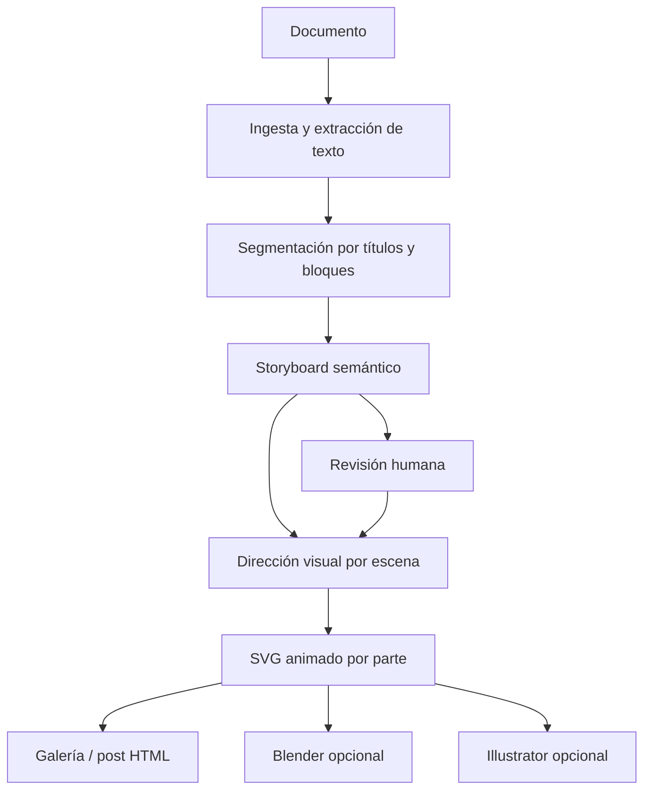

# Workflow: documento → post ilustrado animado

## Objetivo

Recibir un documento, dividirlo en partes con sentido editorial y producir
una ilustración SVG animada para cada parte, junto con una galería navegable y
un storyboard revisable.

La unidad de trabajo no es el párrafo: es una **idea visual**. Cada parte debe
conservar el texto fuente, un resumen, palabras clave, tono, dirección visual
y el archivo SVG generado.

## Flujo



## Entrada

La versión local ejecutable acepta:

- Markdown (`.md`)
- Texto plano (`.txt`)
- HTML (`.html`)

Después se pueden añadir PDF y DOCX mediante extractores específicos. El
el documento original siempre se conserva dentro del job y PDF/DOCX se extraen
con los adaptadores Python locales.

Opciones del workflow:

```json
{
  "document": "path/to/document.md",
  "style": "editorial",
  "animation": "float",
  "maxParts": 12,
  "minChars": 180,
  "splitBy": "auto",
  "splitPlan": null,
  "designPath": "templates/design.instagram-portrait.json",
  "blender": false,
  "adobeApp": null
}
```

## Storyboard intermedio

El storyboard es el contrato que se revisa antes de dibujar:

```json
{
  "title": "Nombre de la publicación",
  "style": "editorial",
  "parts": [
    {
      "id": "01-origen",
      "title": "Origen",
      "sourceText": "Texto original de la sección...",
      "summary": "Una frase que concentra la idea.",
      "keywords": ["comunidad", "noche", "transformación"],
      "mood": "nocturno",
      "visual": "formas concéntricas y un núcleo pulsante",
      "palette": ["#08070a", "#c084fc", "#f5d0fe"],
      "animation": "pulse",
      "output": "output/parts/01-origen.svg"
    }
  ]
}
```

## Reglas de segmentación

1. Usar títulos Markdown/HTML como cortes principales.
2. Si no hay títulos, usar bloques de párrafos y conservar el orden.
3. Unir bloques demasiado cortos con el siguiente.
4. Limitar la cantidad de escenas para que el post siga siendo legible.
5. No inventar hechos: el resumen debe poder rastrearse al texto original.
6. Permitir editar el storyboard antes de generar la ilustración.

También puedes controlar el corte directamente:

```powershell
npm run tool -- workflow document-to-animated-post `
  --document C:\ruta\documento.pdf `
  --split-by pages
```

Para cortes editoriales exactos, usa un JSON:

```json
{
  "parts": [
    { "title": "Qué es", "start": "¿Qué es el chemsex?" },
    { "title": "Reducción de daños", "start": "Reducción de daños" },
    { "title": "Cómo cuidarnos", "start": "Cómo cuidarnos" }
  ]
}
```

Y ejecútalo con `--split-plan C:\ruta\cortes.json`. Cada corte comienza en su
marcador y termina justo antes del siguiente.

## Salida de un job

```text
jobs/<id>/
├── input/document.md
├── work/sections.json
├── work/storyboard.json
├── output/parts/01-origen.svg
├── output/parts/02-...svg
├── output/post.html
├── output/manifest.json
├── status.json
└── summary.md
```

`post.html` debe incluir navegación, pausa global y soporte para
`prefers-reduced-motion`. Los SVG deben tener `title`, `desc`, `role="img"` y
no depender de recursos externos.

## Uso real

```powershell
npm run tool -- workflow document-to-animated-post `
  --document C:\ruta\documento.pdf `
  --title "Mi publicación" `
  --max-parts 8 `
  --design C:\IA\svg\agent-toolkit\templates\design.instagram-portrait.json `
  --blender `
  --adobe illustrator
```

La salida principal es `output/post.html`; el storyboard JSON y el resumen son
archivos internos de control, no el producto final.

## Especificación visual

El archivo de diseño controla directamente el resultado:

- `canvas.width` y `canvas.height`: píxeles finales y proporción.
- `margins.top/right/bottom/left`: área segura en píxeles.
- `colors`: fondo, acento, resaltado, texto y texto secundario.
- `typography`: familias y tamaños tipográficos.
- `layout`: recuadros normalizados para texto e ilustración; se convierten a píxeles según el lienzo.
- `iconMode`: `auto`, `manual` o `none`; los iconos se generan como trazos SVG editables.

Presets disponibles: `instagram-portrait`, `instagram-square`, `story` y
`landscape`. La plantilla editable es
`templates/design.instagram-portrait.json`.

## Panel de decisión

Para elegir estos valores visualmente, inicia el puente local:

```powershell
npm run server
```

Después abre en el navegador:

```text
http://127.0.0.1:47921/planner?document=C:\Users\issvk\claude_sesiones_recuperadas\CARRUSEL%20CHEMSEX%20RevCO.pdf
```

El panel permite seleccionar el modo de división, escribir cortes personalizados,
definir ancho/alto, márgenes por lado, colores, tipografías, animación y la
distribución entre texto e ilustración. Los recuadros se pueden arrastrar en la
previsualización. También permite generar iconos automáticamente a partir de
las palabras clave o elegirlos manualmente. Los iconos se producen como trazos
SVG editables y el botón de generación envía todas las láminas a la cola de
Illustrator.

## Integración con Blender e Illustrator

- Blender recibe una escena seleccionada o todas las escenas para generar
  renders de referencia.
- Illustrator recibe los SVG vectoriales mediante la cola ya existente.
- La generación del post no depende de que Adobe esté abierto.
- Si Adobe no consume la cola, el job queda en `waiting-for-adobe` sin perder
  los SVG ni el HTML.

## Decisión inicial

La primera implementación debe ser determinista y local: segmentación,
storyboard editable y plantillas SVG. La interpretación semántica puede ser
refinada por el agente, pero nunca debe saltarse el storyboard, porque ese es
el punto donde se corrigen errores de lectura antes de producir 12 ilustraciones.
