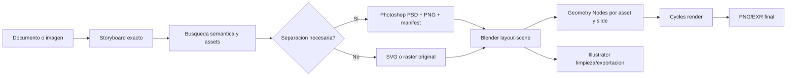

# Guía de integración multi-aplicación

## Objetivo

El flujo separa cuatro responsabilidades:

1. El toolkit mantiene texto exacto, storyboard, procedencia, manifiestos y
   jobs reproducibles.
2. Las librerías locales aportan primitivas y cálculo cuando existe un wrapper
   declarado.
3. Adobe prepara o separa material cuando la semántica de la imagen lo exige.
4. Blender compone, anima y renderiza la salida final en Cycles.

La escena `.blend` no reemplaza los datos de entrada: es un artefacto editable
regenerable desde el storyboard y el manifest de assets.

## Qué está realmente conectado

Ejecuta:

```powershell
cd C:\IA\svg\agent-toolkit
npm run tool -- integration sources
npm run tool -- integration validate
```

El primer comando solo inspecciona raíces y archivos de metadata directos. El
segundo comprueba contratos, scripts y entrypoints. No enumera todos los
Markdown, Python o `node_modules` de las bibliotecas.

Los estados tienen una diferencia importante:

- `integrated-runtime`: el toolkit llama un adaptador local.
- `partial-runtime`: existe el adaptador, pero el host requiere una ejecución
  externa o una prueba pendiente.
- `available-source`: la fuente está disponible para construir wrappers; no se
  importa por accidente ni se afirma que ya sea una herramienta ejecutable.

## Flujo canónico



## Contratos

El puente entre aplicaciones es JSON. Las tres piezas principales son:

- `asset`: identifica el archivo, su tipo, procedencia, slide, placement y
  controles visuales.
- `storyboard`: declara canvas, partes, cajas de texto, cajas de ilustración y
  assets.
- `separation-manifest`: registra objetos derivados, bounds, método de selección
  y errores del host.

La especificación completa se encuentra en
[`integrations/scripting-map.json`](integrations/scripting-map.json). Los
manifiestos deben conservar el texto original y no deben convertir una
aproximación visual en una afirmación semántica.

## Adobe

Photoshop se integra por dos superficies: UXP `.psjs` y fallback JSX/COM.
Illustrator usa `agent.jsx` para importar SVG con IDs de zona. After Effects y
Premiere tienen consumidores de cola, pero son etapas opcionales hasta que el
host produzca una prueba verificable.

Para una separación:

```powershell
npm run tool -- photoshop separate-objects `
  --input projects/chemsex/generated/slide-08-close-flat-v6.png `
  --mode regions `
  --objects tests/fixtures/photoshop-regions.json `
  --output separated/manifest.json `
  --psd-output separated/objects.psd
```

El resultado se puede conectar a Blender con `assetManifest`. Photoshop debe
registrar si la selección fue semántica o `rectangle-fallback`; el usuario
puede revisar el PSD antes de continuar.

Para ejecutar una composición declarativa completa, `workflow.multi-app-composition`
crea un único job, copia el storyboard y sus assets a `input/`, ejecuta
`blender.layout-scene` con Geometry Nodes y Cycles, y deja las órdenes Adobe en
el mismo job. Así el `.blend`, el render y las órdenes de Illustrator/Photoshop
comparten el mismo manifest y no quedan repartidos en jobs anidados. Si se
indica `--project-root`, también copia los artefactos editables al proyecto:
`editable/blender`, `editable/photoshop`, `manifests` y `renders`.

```powershell
npm run tool -- workflow multi-app-composition --storyboard storyboard.json --project-root projects/chemsex --adobe photoshop --adobe-operation separate-objects
```

La orden queda en estado `waiting-for-adobe` hasta que Photoshop consuma el
comando. Ese estado significa que está esperando la aplicación abierta; no se
interpreta como fallo. El PSD, los PNG transparentes y el manifiesto de objetos
se escriben dentro del `project-root` indicado.

## Blender y Geometry Nodes

Blender recibe el storyboard y construye un grupo `GN_Slide_XX_<theme>` por
parte, además de `GN_Asset_2D_Transform` en cada asset. Esto permite cambiar
escala, offset, rotación, profundidad y pulso desde el modifier sin volver a
generar el SVG.

```powershell
npm run tool -- blender run `
  --operation layout-scene `
  --spec projects/chemsex/storyboard.json `
  --output jobs/manual/output/chemsex.blend `
  --render-output jobs/manual/output/chemsex.png
```

Para producción, añadir al storyboard:

```json
{ "render": { "mode": "slide", "slide": 2, "showGuides": false } }
```

El renderer fuerza Cycles. El documento técnico de sockets, coordenadas,
materiales y animación está en
[`adapters/blender/GEOMETRY-NODES.md`](adapters/blender/GEOMETRY-NODES.md).

## Posibilidades de las fuentes locales

| Fuente | Uso recomendado en este entorno | Estado actual |
|---|---|---|
| thi.ng umbrella | primitivas SVG y geometría declarativa | `svg.thi-ng-geom` integrado; resto por wrappers progresivos |
| D3 | escalas, jerarquías, layouts y mapeo de datos a SVG | `data.d3-chart` integrado |
| three.js | preview web, cámara/materiales y prototipos 3D | `scene3d.create` integrado |
| Effect | retries, recursos, concurrencia estructurada y jobs durables | `workflow.effect-retry` integrado |
| RxJS | streams de eventos, controles live y progreso de render | `workflow.rxjs-events` integrado |
| stdlib | cálculo numérico, estadística y señales | `math.stdlib-stats` integrado |
| GDKB | iconografía semántica, identidad, evidencia y procedencia | bridge integrado |
| Blender adapter | composición editable, Geometry Nodes, Cycles y exportación | runtime integrado |
| Adobe adapter | separación, limpieza vectorial y colas host | runtime parcial |

La regla es añadir un wrapper pequeño y una prueba antes de convertir una
fuente disponible en runtime. Por ejemplo, un futuro `svg.layout` puede usar
thi.ng/D3 internamente, pero su entrada y salida deben seguir el contrato del
toolkit y poder validarse sin cargar toda la librería en el agente.

Los wrappers de `source-runtime.mjs` usan únicamente superficies declarativas:
three.js genera un preview HTML local, stdlib calcula estadísticas sobre arrays,
RxJS procesa eventos ya materializados y Effect aplica retries acotados. Ninguno
ejecuta Javascript recibido desde una petición ni sustituye a Blender como
compositor/renderizador final.

## Scripting por host

### Node.js

Usar `src/dispatcher.mjs` como única puerta de ejecución web y `src/cli.mjs`
para la consola. No agregar llamadas shell arbitrarias al dispatcher. Toda
operación debe entrar al registro y mantener sus archivos dentro del job.

### Python / CairoSVG

Usar Python para rasterización SVG y utilidades de imagen. El SVG fuente se
conserva; CairoSVG es una ruta de apariencia cuando filtros, texto o gradientes
no pueden mantenerse como curvas Blender.

### Blender Python

Usar `adapters/blender/agent_blender.py` para escenas repetibles. Para editar
una instancia abierta, usar el puente de consola versionado y luego persistir
la modificación en el manifiesto o en una receta documentada.

### Adobe JSX/UXP

Los comandos son envelopes de trabajo, no scripts enviados por una petición
remota. Una nueva acción Photoshop debe encapsularse en el adapter y registrarse
en `adapters/adobe/command-schema.json` y `registry.json`.

## Verificación de una integración nueva

1. Agregar la fuente o adapter a `integrations/tool-sources.json`.
2. Declarar la superficie y los contratos en `integrations/scripting-map.json`.
3. Implementar el wrapper allowlisted.
4. Añadir una entrada a `registry.json`.
5. Añadir prueba determinista sin host cuando sea posible.
6. Ejecutar `integration validate`, `npm test` y `npm run verify`.
7. Si depende de Adobe o Blender, agregar evidencia real del host y mantener
   explícito cualquier estado pendiente.

## Fuera del alcance automático

No se importan automáticamente todos los paquetes en Node ni se instalan
addons de Blender sin una receta específica. Tampoco se borra evidencia,
manifiestos, PSD o bases de datos para "limpiar" un job. La automatización
crece por contratos y adapters, lo que deja el entorno escalable para el
trabajo personal, la comunidad de diseñadores/VJs y los materiales de la ONG.
